# ChorePal – User Manual

**Version:** 2.1  
**Team Name:** Team 2  
**Team Lead:** Samuel Angulo  
**Members:** Cole Brooks, Adam Jabbar, Isaac Lindsay, Doreen Lobe  
**Sponsor:** Diana Rabah  
**Date:** 10/06/2026  

---

> **TEAM WORKFLOW NOTES**  
> Each section has an assigned owner.  
> - Work **only** in your assigned section.  
> - Create a branch named after your section (example: `section-introduction-samuel`).  
> - When finished, open a Pull Request.  
> - Do **not** edit other people’s sections unless asked.  
> - Keep the `images/` folder structure exactly as it is.

---

## 1. Introduction
<!-- OWNER: Cole Brooks -->
<!-- STATUS: Needs review / final polish -->

ChorePal is a family-focused mobile application that turns everyday household chores into a fun, rewarding experience. Parents create and assign chores, set coin values, and approve completed work using photo verification. Children complete tasks, upload photos for review, earn coins, and redeem them for rewards. The app helps families build responsibility, track progress, and keep everyone motivated with clear goals and positive feedback.

---

## 2. System Requirements
<!-- OWNER: Samuel Angulo -->
<!-- STATUS: Please expand or adjust based on final tech stack (web vs native, exact browser support, etc.) -->

- **Hardware:**  
  - Smartphone or tablet (iPhone, iPad) 
  - Camera (used for photo verification of chores; children can also upload an existing photo from their camera roll)  
  - Minimum 2 GB RAM  
  - Active internet connection (Wi-Fi or mobile data). ChorePal needs it to sync chores, upload photos, and run the photo check verification.

- **Software:**  
  - The installed ChorePal app **or** a modern mobile browser (Safari, Chrome, Firefox, or Edge)  
  - iOS 14+ is recommended

- **Permissions (asked the first time they are needed):**  
  - **Camera and photo library** - to take or upload chore photos  
  - **Notifications** - so parents are told when a chore is submitted and children are told when it is approved or rejected  
  - **Location (optional)** - so a child is reminded when they arrive or leave the house to do their chores

- **Other Dependencies:**  
  - Valid email address (only for parent account creation, kids do not need an email address)  
  - Family code + PIN (created when the parent adds a child, then shared with that child so they can join the family)

---

## 3. Installation Guide
<!-- OWNER: Adam Jabbar -->
<!-- STATUS: Update with the real live URL once the app is deployed -->

ChorePal is a web-based application. **No installation is required.**

1. Open a web browser on your phone or tablet.  
2. Go to the ChorePal live URL provided by your team or instructor.  
3. (Optional) On mobile, use “Add to Home Screen” so ChorePal appears like a regular app.  

If a native app version is available for your course, download it from the link provided by the team and install it normally.

---

## 4. Getting Started
<!-- OWNER: Samuel Angulo -->

> **Tip:** The parent sets up the family first. A child cannot join until a parent has created their profile and given them the Family Code and PIN.

### Step 1 - Open the app
Open ChorePal. You will see the **Startup Screen**.

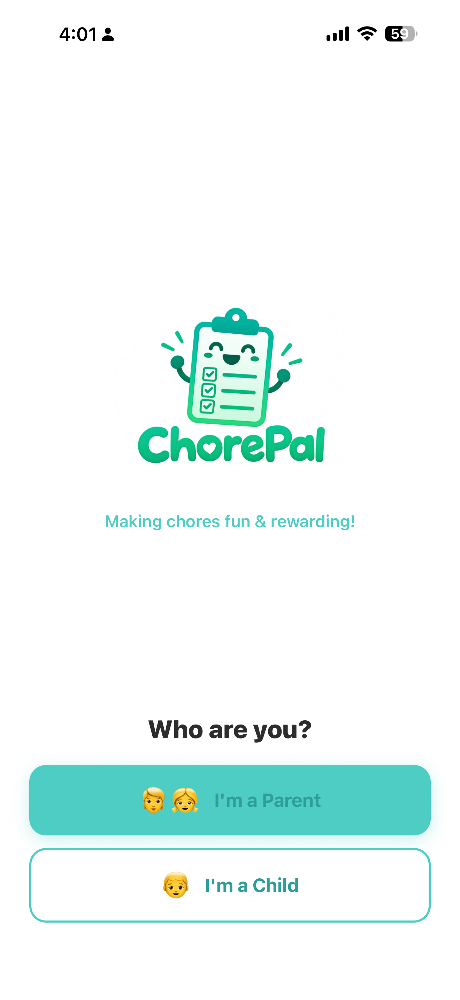

### Step 2 - Choose your role
- Tap **"I'm a Parent"** if you are setting up the family.  
- Tap **"I'm a Child"** if your parent has already given you a Family Code and PIN to use.

### Step 3 - Create a Parent Account
1. Enter your Full Name, Email, and Password.  
2. Confirm the password.  
3. Tap **Create Account**.

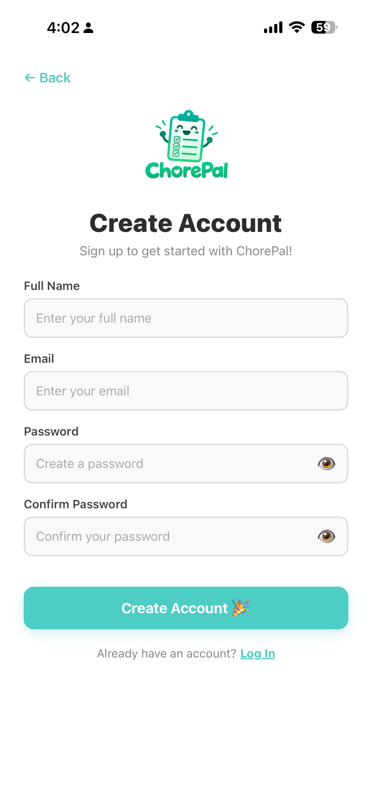

### Step 4 - Parent Login (returning users)
Use your email and password on the Parent Login screen.

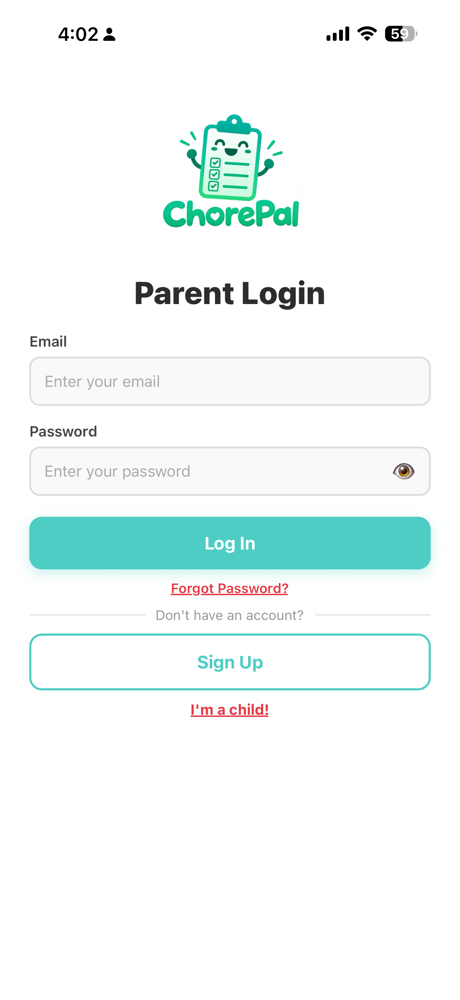

### Step 5 - Child joins the family
1. Select **"I'm a Child"**.  
2. Enter the **Family Code** and **PIN** given by your parent.  
3. Tap **Join**.

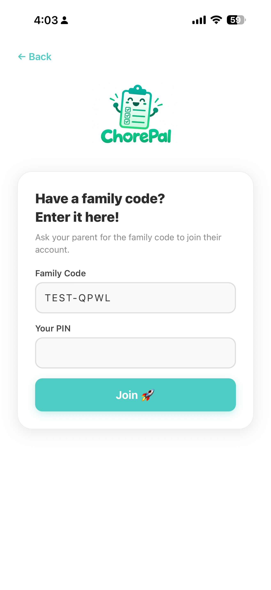

### Step 6 - First actions after login
- **Parents:** Add your children and create some chores. Explore what the app has to offer!!
- **Children:** Check if you have any assigned chores, click on them and upload a photo.

### First-time tips
- Allow **camera**, **notifications** and **Location Tracking** when asked. Photo verification, approval reminders need them.  
- Each time a child logs onto a device they will need their family code and pin. Click on your child account to access these if you need them   again.
- If something goes wrong, see **Troubleshooting** (Section 6).

---

## 5. Features & Functions

### Feature 1: Parent Dashboard & Family Management
<!-- OWNER: Sam Angulo -->

The Parent Dashboard is the central hub. Here you can see all kids, add new children, and quickly jump to creating chores, rewards, and approving chores.

**How to use it:**
1. After logging in you land on the Parent Dashboard.  
2. Under **Kids Accounts** you see each child's profile and unique family code.  
3. Tap the **+ Add Kid** card to create a new child profile.  
4. Use the **Quick Actions** buttons (Create Chore, Create Reward, Approvals, and Discipline) for fast navigation.
5. You can also use the bottom navigation bar (**Chores**, **Kids**, **Rewards**, **Settings**) from any parent screen.

**Tips:**
- Share each child's Family Code and PIN with them so they can join (see Getting Started, Step 5).  
- Check **Approvals** regularly. As the parent you have the final say in whether or not a chore is finished. Approvals allows you to see the photo your child submitted as well as the ChorePal Verification feedback they received. Children are notified as soon as you approve or reject a chore.
- Don't remember the child's Family Code? No worries! Click on the child account to see their family code, pressing the edit button at the bottom allows you to see the pin you set. Everything besides the family-code on the child account is editable.

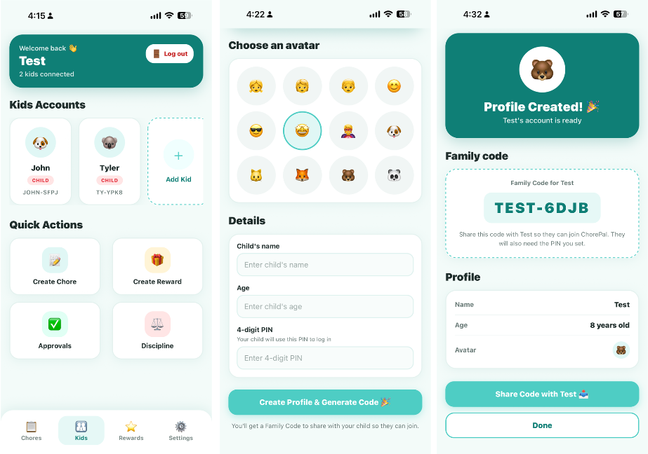

---

### Feature 2: Creating & Managing Chores
<!-- OWNER: Isaac Lindsay -->
<!-- STATUS: Please verify the exact fields on the Create/Edit Chore screens and update steps if anything has changed. -->

Parents can create chores, assign them to specific children, set coin values, due dates, and mark them as recurring.

**How to use it:**
1. From the dashboard or bottom navigation, tap **Chores**.  
2. You will see a summary (Total / Approved / Pending Review).  
3. Expand a child’s section to view their chores.  
4. Tap **+ Add** or **+ Add Chore for [Child name]**.  
5. Fill in the chore name, coin value, due date, and whether it is recurring.  
6. Save the chore. You can later edit any chore from the list.

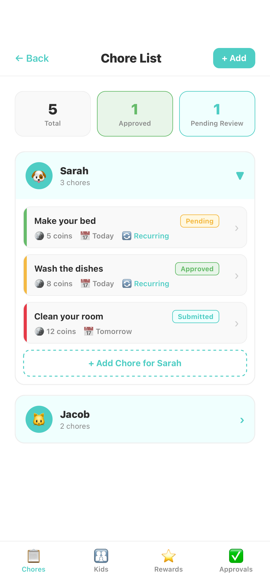

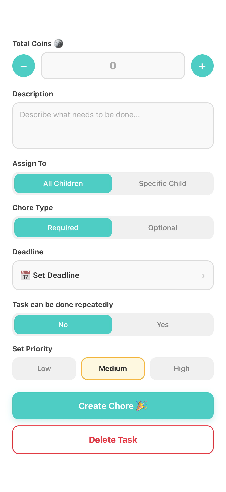

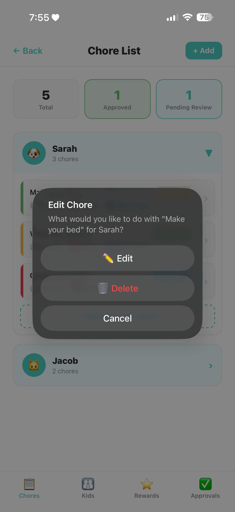

---

### Feature 3: Child Dashboard & Photo Verification
<!-- OWNER: Cole Brooks -->
<!-- STATUS: This is a key section. Please make sure the photo upload + feedback flow is accurate and clear for non-technical users. -->

Children see their personal progress, list of chores, and can submit photo proof for parent approval. After submission they also receive ChorePal Verification Feedback.

**How to use it:**
1. After joining with a family code, the child lands on **My Activities**.  
2. The Daily Progress bar shows how much of today’s work is done.  
3. Incomplete chores have a red X and a camera button.  
4. Tap the camera button → choose **Take Photo** or **Upload**.  
5. Tap **Submit for Approval**.  
6. A confirmation screen appears with feedback.

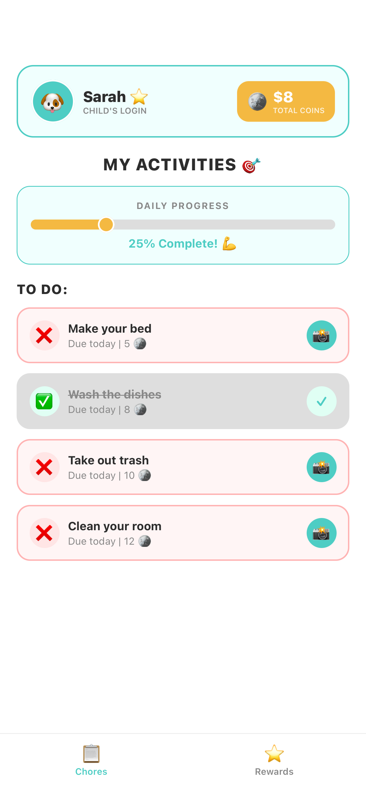

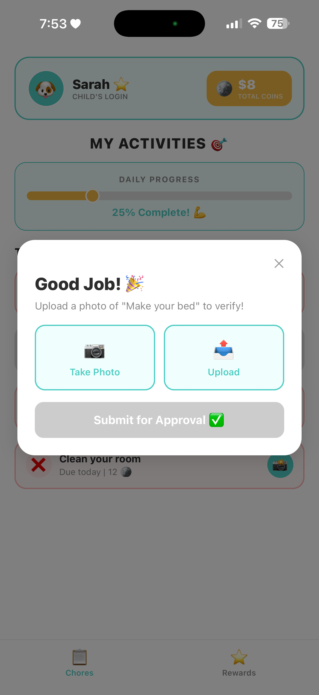

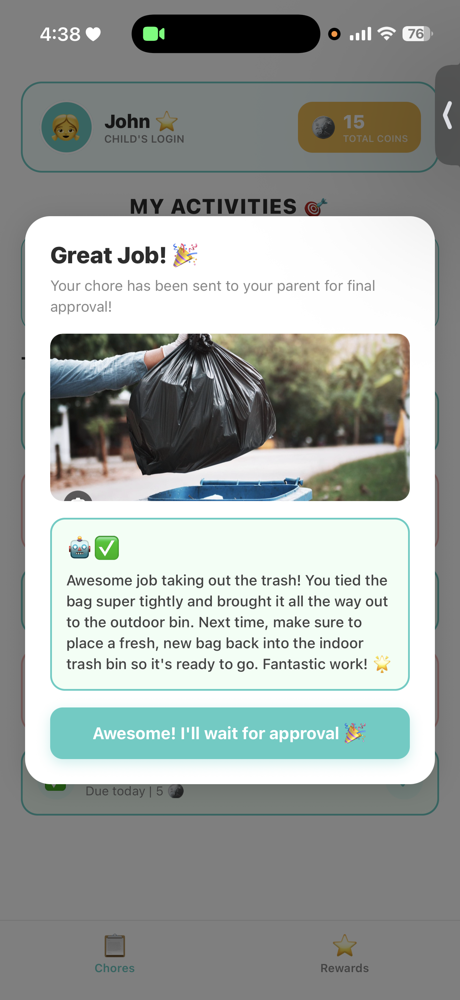

---

### Feature 4: Approvals
<!-- OWNER: Doreen Lobe -->
<!-- STATUS: Confirm the approval/reject flow and any notes a parent can leave. -->

Parents review every photo submission and decide whether to approve (award coins) or request a re-do.

**How to use it:**
1. Tap **Approvals** in the bottom navigation or Quick Actions.  
2. Review the pending photos and details.  
3. Approve to give the child their coins, or reject with a note.

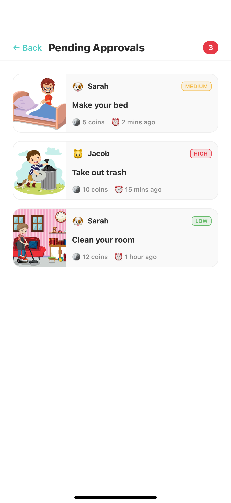

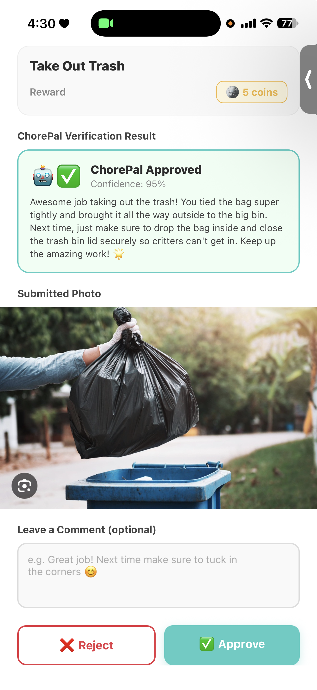

---

### Feature 5: Rewards
<!-- OWNER: Adam Jabbar -->
<!-- STATUS: Coordinate so the parent creation steps and child redemption steps match. -->

Parents create rewards that children can buy with the coins they earn. Children browse and redeem rewards from their own Rewards page.

**How to use it (Parent):**
1. Go to **Rewards**.  
2. Tap to create a new reward, set the coin cost, and optionally choose an icon.  
3. Save the reward so it appears in the child’s store.

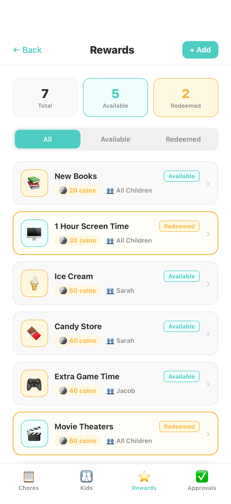

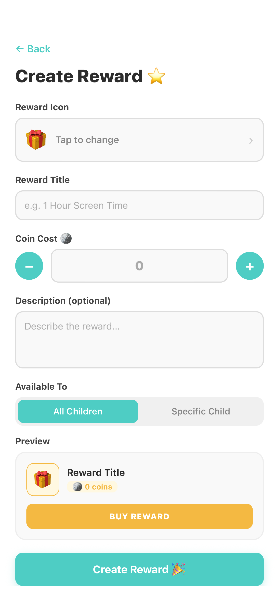

**How to use it (Child):**
1. Tap the **Rewards** star icon at the bottom.  
2. Browse available rewards and their coin costs.  
3. Tap **Buy** when you have enough coins.

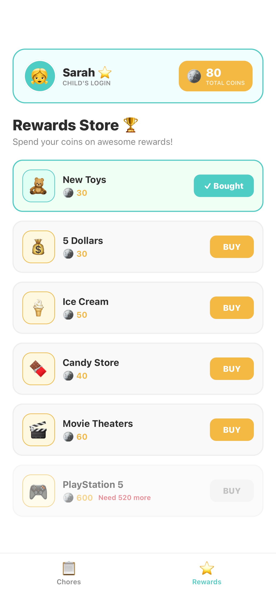

---

## 6. Troubleshooting
<!-- OWNER: Cole Brooks -->
<!-- STATUS: Add any real issues the team has already encountered during testing. Aim for at least 4–5 common problems. -->

| Problem | Possible Cause | Solution |
|---------|----------------|----------|
| App will not load / blank screen | No internet or wrong URL | Check Wi-Fi/mobile data and refresh, or re-enter the correct URL. |
| Child cannot join | Wrong Family Code or PIN | Ask the parent for the current code and 4-digit PIN shown on the child’s card. |
| Photo upload fails | Camera permission denied or weak connection | Allow camera access in browser/device settings, or try uploading from the photo gallery. |
| Coins not awarded | Parent has not approved the chore yet | Wait for parent approval or remind them to check the Approvals tab. |
| Login fails | Incorrect email/password | Double-check spelling or use the “Log In” link on the Create Account screen. |

---

## 7. Contact Information
<!-- OWNER: Doreen Lobe -->
<!-- STATUS: Replace placeholders with real team email, GitHub link, etc. -->

- **Support Email:** chorepal.team2@example.com (replace with your actual team support email)  
- **Project Repository:** [Link to your GitHub/GitLab repository]  
- **Sponsor / Instructor:** Diana Rabah (via course channels)  
- **Team Lead:** Samuel Angulo  

When requesting help, please include your device type, browser, and a short description (or screenshot) of the issue.

---

## 8. FAQ (Extra Credit)
<!-- OWNER: Isaac Lindsay -->
<!-- STATUS: Feel free to add more questions based on what users actually ask during testing. -->

**Q: Can one parent account manage multiple children?**  
**A:** Yes. From the Parent Dashboard you can add as many children as you need. Each child receives a unique family code.

**Q: Do children need their own email address?**  
**A:** No. Children join using only the Family Code and PIN created by the parent.

**Q: What happens if a submitted photo does not clearly show the chore was completed?**  
**A:** The parent can reject the submission in the Approvals section and ask the child to re-do the chore and upload a clearer photo.

**Q: Can chores repeat automatically?**  
**A:** Yes. When creating or editing a chore, parents can mark it as “Recurring” so it reappears on the child’s list according to the schedule.

**Q: Where do children see how many coins they have?**  
**A:** The total coin balance appears at the top of the Child Dashboard and on the Rewards page.

---

*Thank you for using ChorePal!*  
*Making chores fun & rewarding for the whole family.*  
*© 2026 Team 2*
