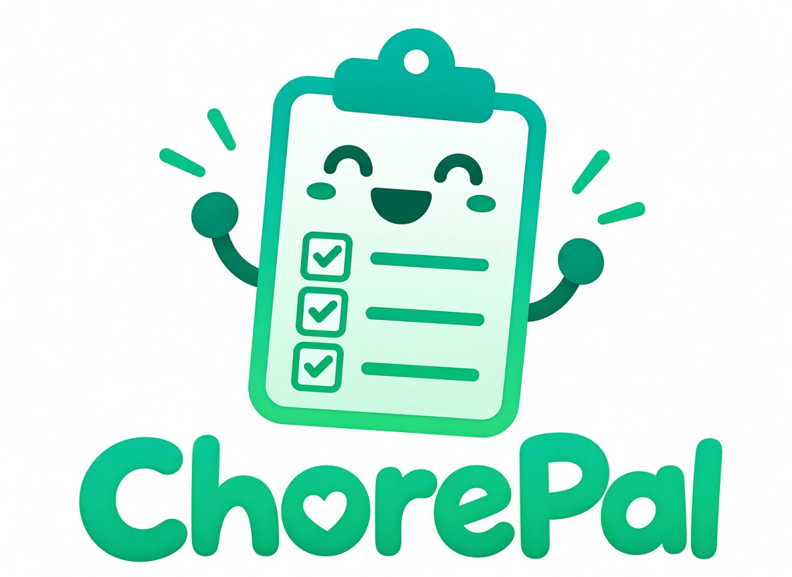
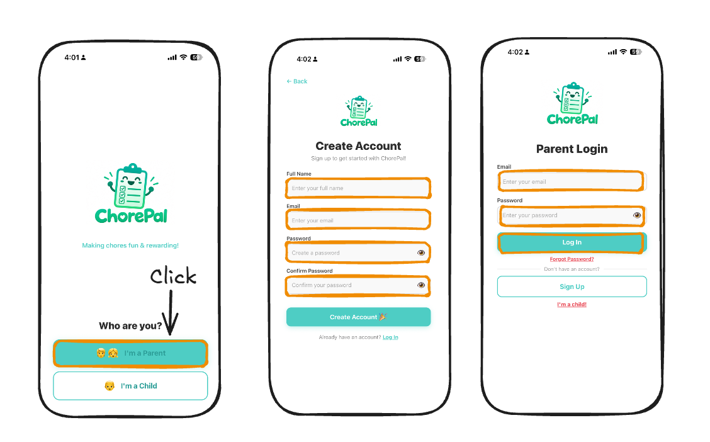
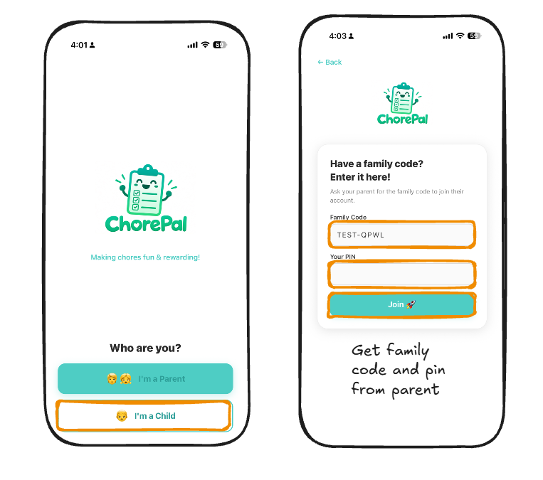
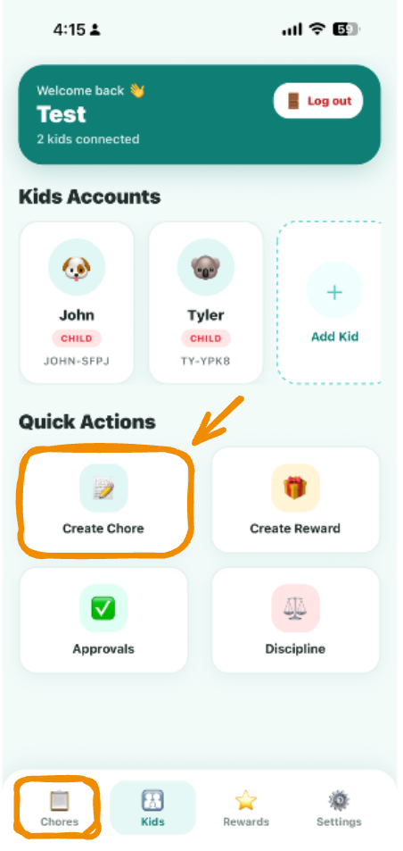
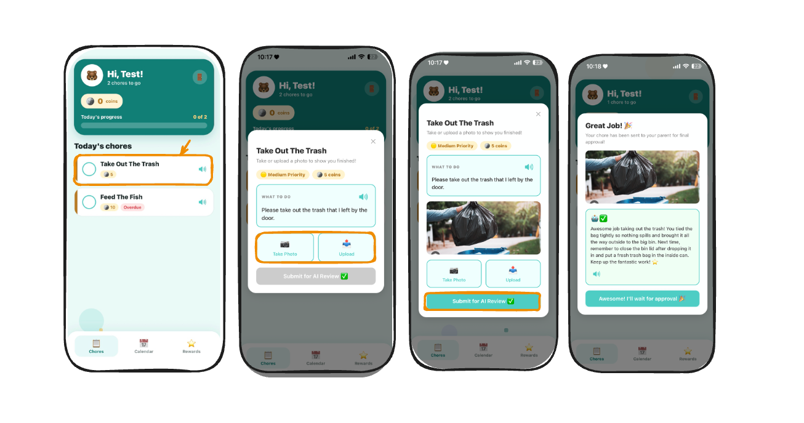
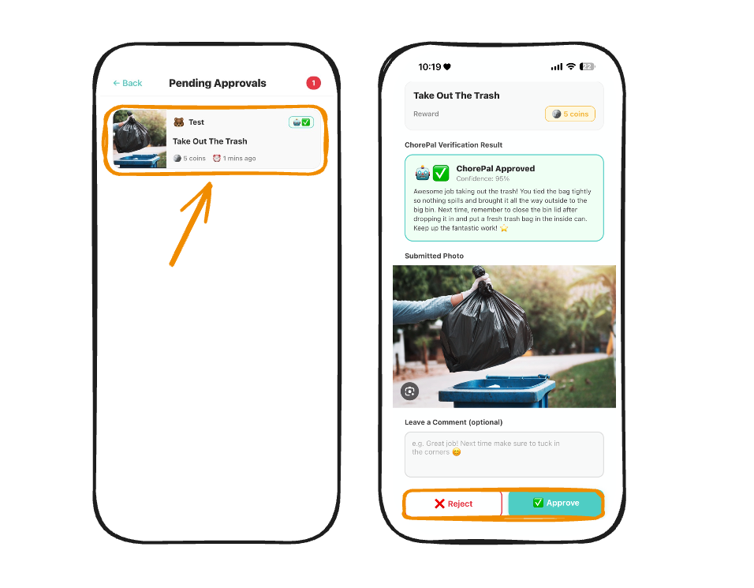
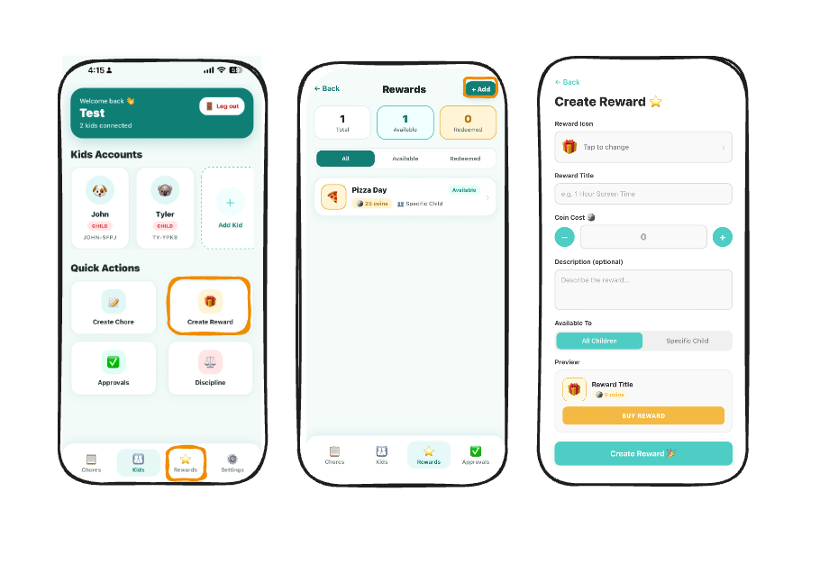
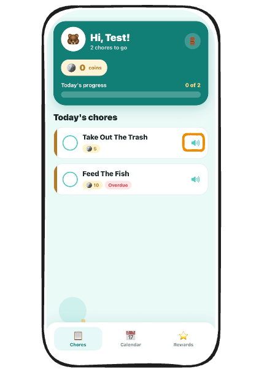

# 📖 User Manual

### ✨ Making chores fun & rewarding for the whole family! ✨

| | |
|:--|:--|
| 👑 **Team Lead** | Samuel Angulo |
| 🧑‍💻 **Members** | Cole Brooks, Adam Jabbar, Isaac Lindsay, Doreen Lobe |
| 🎓 **Sponsor** | Diana Rabah |
| 📅 **Date** | 10/06/2026 |

---

## 🧭 What do you want to do?

| I am a... | Start here |
|:--|:--|
| 👩‍👧 **Parent** | [Install the app](#installation) → [Create your account](#getting-started) → [Add kids & chores](#feature-1) |
| 🧒 **Child** | [Join with your Family Code](#getting-started) → [Do a chore](#feature-3) → [Spend your coins](#feature-5) |
| 🆘 **Stuck?** | [Troubleshooting](#troubleshooting) or [Contact us](#contact) |

---

## 📑 Table of Contents

1. [👋 Introduction](#introduction)
2. [💻 System Requirements](#system-requirements)
3. [📲 Installation Guide](#installation)
4. [🚀 Getting Started](#getting-started)
5. [⭐ Features & Functions](#features)
   - [Feature 1: Parent Dashboard & Family Management](#feature-1)
   - [Feature 2: Creating & Managing Chores](#feature-2)
   - [Feature 3: Child Dashboard & Photo Verification](#feature-3)
   - [Feature 4: Approvals](#feature-4)
   - [Feature 5: Rewards](#feature-5)
   - [Feature 6: Text-to-Speech (Read Aloud)](#feature-6)
6. [🛠️ Troubleshooting](#troubleshooting)
7. [💌 Contact Information](#contact)
9. [⚠️ Discipline System](#discipline)
10. [❓ FAQ](#faq)

---

## 👋 1. Introduction

ChorePal is a family-focused mobile application designed to make household chores easier to manage and more rewarding for children. Parents can create and assign chores, set coin values, review completed work, and create rewards for their children to earn. Children can view their assigned chores, submit photo proof when a task is finished, receive feedback, earn coins, and use those coins to redeem rewards.

The goal of ChorePal is to help families stay organized while encouraging responsibility and independence. Features such as photo verification, progress tracking, rewards, notifications, and parent approval help make chores more interactive while still giving parents control over the final approval process.

This manual explains how to install and use ChorePal, including account setup, parent and child features, chore completion, rewards, troubleshooting, and other important functions within the application.

### 🔄 How ChorePal works

| 1️⃣ | 2️⃣ | 3️⃣ | 4️⃣ | 5️⃣ |
|:--:|:--:|:--:|:--:|:--:|
| 📝 **Parent creates a chore** | 📸 **Child sends a photo** | 🤖 **ChorePal checks it** | ✅ **Parent approves** | 🪙 **Child earns coins & buys rewards** |

---

## 💻 2. System Requirements

### 📱 Hardware
- Smartphone or tablet (iPhone, iPad)
- Camera (used for photo verification of chores; children can also upload an existing photo from their camera roll)
- Minimum 2 GB RAM
- Active internet connection (Wi-Fi or mobile data). ChorePal needs it to sync chores, upload photos, and run the photo check verification.

### 🧩 Software
- The installed ChorePal app **or** a modern mobile browser (Safari, Chrome, Firefox, or Edge)
- iOS 14+ is recommended

### 🔐 Permissions *(asked the first time they are needed)*

| Permission | Why ChorePal needs it |
|:--|:--|
| 📷 **Camera and photo library** | To take or upload chore photos |
| 🔔 **Notifications** | So parents are told when a chore is submitted and children are told when it is approved or rejected |
| 📍 **Location** *(optional)* | So a child is reminded when they arrive or leave the house to do their chores |

### 📦 Other Dependencies
- Valid email address (only for parent account creation, kids do not need an email address)
- Family code + PIN (created when the parent adds a child, then shared with that child so they can join the family)

---

## 📲 3. Installation Guide

ChorePal is a mobile application that can be accessed using Expo Go during development and testing.

**How to install ChorePal:**
1. Open the App Store on your iPhone or iPad.
2. Search for Expo Go and install it.
3. Open Expo Go once the installation is complete.
4. Get the ChorePal QR code or development link from the team.
5. Scan the QR code using your device's camera or open the provided link.
6. Wait for ChorePal to load in Expo Go.
7. Once the application opens, select I'm a Parent or I'm a Child to begin.

> [!IMPORTANT]
> - An active internet connection is required.
> - Allow camera and notification permissions when requested.
> - Parents must create an account before children can join.
> - Children need their Family Code and PIN to log in.

---

## 🚀 4. Getting Started

> [!TIP]
> The parent sets up the family first. A child cannot join until a parent has created their profile and given them the Family Code and PIN.

### 📱 Step 1 - Open the app
Open ChorePal. You will see the **Startup Screen**.

### 🎭 Step 2 - Choose your role
- 👩‍👧 Tap **"I'm a Parent"** if you are setting up the family.
- 🧒 Tap **"I'm a Child"** if your parent has already given you a Family Code and PIN to use.

### ✍️ Step 3 - Create a Parent Account
1. Enter your Full Name, Email, and Password.
2. Confirm the password.
3. Tap **Create Account**.

### 🔑 Step 4 - Parent Login (returning users)
Use your email and password on the Parent Login screen.

  

### 🏡 Step 5 - Child joins the family
1. Select **"I'm a Child"**.
2. Enter the **Family Code** and **PIN** given by your parent.
3. Tap **Join**.

  

### 🎉 Step 6 - First actions after login
- **Parents:** Add your children and create some chores. Explore what the app has to offer!!
- **Children:** Check if you have any assigned chores, click on them and upload a photo.

> [!TIP]
> **First-time tips**
> - Allow **camera**, **notifications** and **Location Tracking** when asked. Photo verification and approval reminders need them.
> - Each time a child logs onto a device they will need their family code and pin. Click on your child account to access these if you need them again.
> - If something goes wrong, see [**Troubleshooting**](#troubleshooting) (Section 6).

---

## ⭐ 5. Features & Functions

### 🏠 Feature 1: Parent Dashboard & Family Management
`👩‍👧 For Parents`

The Parent Dashboard is the central hub. Here you can see all kids, add new children, and quickly jump to creating chores, rewards, and approving chores.

**How to use it:**
1. After logging in you land on the Parent Dashboard.
2. Under **Kids Accounts** you see each child's profile and unique family code.
3. Tap the **+ Add Kid** card to create a new child profile.
4. Use the **Quick Actions** buttons (Create Chore, Create Reward, Approvals, and Discipline) for fast navigation.
5. You can also use the bottom navigation bar (**Chores**, **Kids**, **Rewards**, **Settings**) from any parent screen.

> [!TIP]
> - Share each child's Family Code and PIN with them so they can join (see [Getting Started, Step 5](#getting-started)).
> - Check **Approvals** regularly. As the parent you have the final say in whether or not a chore is finished. Approvals allows you to see the photo your child submitted as well as the ChorePal Verification feedback they received. Children are notified as soon as you approve or reject a chore.
> - Don't remember the child's Family Code? No worries! Click on the child account to see their family code, pressing the edit button at the bottom allows you to see the pin you set. Everything besides the family-code on the child account is editable.

  

---

### 🧹 Feature 2: Creating & Managing Chores
`👩‍👧 For Parents`

Parents can create chores, assign them to specific children, set coin values, due dates, and mark them as recurring.

**How to use it:**
1. From the dashboard or bottom navigation, tap **Chores**.
2. You will see a summary (Total / Approved / Pending Review).
3. Expand a child’s section to view their chores.
4. Tap **+ Add** or **+ Add Chore for [Child name]**.
5. Fill in the chore name, coin value, due date, and whether it is recurring.
6. Save the chore. You can later edit any chore from the list.

> [!TIP]
> - Click **Create Chore** to quickly create a chore and skip steps 1 and 2.
> - Selecting the highest priority will put the chore at the top of the child's to do list.

  
  &nbsp;&nbsp;
  

---

### 📸 Feature 3: Child Dashboard & Photo Verification
`🧒 For Children`

Children see their personal progress, list of chores, and can submit photo proof for parent approval. After submission they also receive ChorePal Verification Feedback.

**How to use it:**
1. After logging in or joining with a family code, the child lands on the Chores dashboard.
2. Review the coin balance and Today's Progress at the top of the screen.
3. View chores due today. Optional chores appear under Bonus Chores, while future chores can be viewed from the Calendar tab.
4. Tap a chore to open its details. The child can view the description, coin value, priority, and any parent feedback.
5. Tap **Take Photo** or **Upload** to provide proof that the chore was completed.
6. Tap **Submit for AI Review**.
7. ChorePal analyzes the photo. If the photo does not appear to show the completed chore, the child is asked to try again.
8. If the AI review passes, the chore is sent to the parent for final approval.
9. The chore will show a waiting status until the parent approves or rejects it. If rejected, the child can view the parent's feedback and resubmit.

  

---

### ✅ Feature 4: Approvals
`👩‍👧 For Parents`

Parents review every photo submission and decide whether to approve (award coins) or request a re-do.

**How to use it:**
1. Tap **Approvals** in Quick Actions.
2. Click on the list of pending submissions.
3. Review the pending photos and details.
4. Approve to give the child their coins, or reject with a note.

  

---

### 🎁 Feature 5: Rewards
`👩‍👧 For Parents` `🧒 For Children`

The Rewards feature allows parents to create rewards that children can redeem using the coins they earn from completing chores. This motivates and encourages children to complete their assigned chores and work toward certain rewards.

#### 👩‍👧 How to use it (Parent)
1. Log into your parent account.
2. Select Rewards from quick actions or from the bottom navigation menu.
3. Tap the option to create a new reward.
4. Under Reward Icon, tap to select an icon.
5. Enter the Reward Title (e.g., 1 Hour Screen Time).
6. Set the Coin Cost using the + and − buttons (maximum 1,000 coins).
7. Enter a Description of the reward (optional).
8. Under Available To, select All Children or Specific Child.
9. Review the reward details in the Preview section.
10. Create the reward so it becomes available to the selected children.

  

#### 🧒 How to use it (Child)
1. Log into your child account using your Family Code and PIN.
2. Select Rewards from the bottom navigation bar.
3. Go through the available rewards in the reward store.
4. Check the coin cost of each reward.
5. Select Buy Reward when you have enough coins.
6. The coins needed will be removed from your balance after a successful purchase.

  

---

### 🔊 Feature 6: Text-to-Speech (Read Aloud)
`🧒 For Children`

Text-to-Speech lets children listen to their chores, rewards, and feedback instead of reading them. This helps younger children who are still learning to read use ChorePal on their own. A speaker icon appears next to anything that can be read aloud.

**How to use it:**
1. Log into your child account using your Family Code and PIN.
2. Look for the **speaker icon** 🔊 next to a chore, reward, or message.
3. Tap the speaker icon. ChorePal reads the text out loud.
4. While it is reading, the icon changes to a **stop icon** ⏹️. Tap it again to stop early.
5. Tap a different speaker icon at any time to hear something else. The first one stops automatically.

**What can be read aloud:**

| Where | What gets read |
|:--|:--|
| 🧹 **Chore cards** (Chores dashboard) | The chore name and how many coins it is worth |
| 📋 **Chore details** (What To Do) | The chore name, description, priority, and coin value |
| 💬 **Parent feedback** | The message your parent left when they approved or rejected a chore |
| 🤖 **ChorePal Verification Feedback** | The result of the photo check, including whether you need to redo the chore |
| ⚠️ **Point deduction notice** | How many points were taken away and the reason your parent gave |
| 🎁 **Reward cards** (Rewards page) | The reward name and how much it costs |
| 🛍️ **Reward details** (About this reward) | The reward name, description, and coin cost |

> [!TIP]
> - Nothing plays on its own. ChorePal only reads aloud when the speaker icon is tapped.
> - Reading aloud works even when the iPhone or iPad is switched to silent, but the volume still needs to be turned up.
> - The voice reads a little slower than normal speech so it is easier for children to follow.
> - Reading stops by itself when you close the chore or reward you were listening to.
> - There is nothing to turn on. Text-to-Speech is always available on the child screens and needs no extra permissions.

  

---

## 🛠️ 6. Troubleshooting

| Problem | Possible Cause | Solution |
|:--------|:---------------|:---------|
| 📵 App will not load / blank screen | No internet connection or the app did not load correctly | Check Wi-Fi or mobile data, close and reopen the app, and try again. |
| 🔒 Child cannot log in | Incorrect Family Code or PIN | Ask the parent to verify the Family Code and 4-digit PIN shown on the child account. |
| 📷 Photo upload or camera does not work | Camera or photo permissions were denied | Allow camera and photo access in the device settings, then reopen ChorePal and try again. |
| 🤖 AI rejects the chore photo | The photo does not clearly show the completed chore | Retake the photo with the completed chore clearly visible and submit it again for AI review. |
| 🪙 Coins are not awarded | The chore is still waiting for parent approval | Wait for the parent to review the submission in Approvals. Coins are added after the chore is approved. |
| 🔕 Parent or child does not receive notifications | Notification permission is disabled | Make sure notifications are enabled in ChorePal and in the device settings. |

---

## 💌 7. Contact Information

| | |
|:--|:--|
| 📧 **Support Email** | support@chorepal.com |
| 💻 **Project Repository** | https://github.com/SamAnguloUNT/ChorePal |
| 🎓 **Sponsor / Instructor** | Diana Rabah |
| 👥 **Team Members** | Doreen Lobe, Adam Jabbar, Isaac Lindsay, Samuel Angulo, and Cole Brooks |

> [!NOTE]
> When requesting help, please include your device type and a short description (or screenshot) of the issue.

---

## ⚠️ 9. Discipline System
`👩‍👧 For Parents`

The Discipline System lets a parent remove coins from a child's balance when a rule has been broken, for example uploading a false chore photo. Every deduction requires a reason, and the child is told how many points were taken away and why.

**How to use it:**
1. Log into your parent account. Only a logged-in parent can use this feature, and only the children on your account are shown.
2. On the Parent Dashboard, tap **Discipline** in Quick Actions.
3. Under **Select Child**, tap the child's card. Each card shows the child's avatar, name, and current coin balance. The selected child is highlighted in red.
4. Under **Points to Remove**, enter a whole number greater than zero (for example, 10).
5. Under **Reason**, explain why the points are being removed (for example, "Uploaded a false chore photo"). A reason is required.
6. Tap **⚠️ Remove Points**.
7. A confirmation message asks "Remove [number] points from [child's name]?" Tap **Remove** to continue, or **Cancel** to go back without changing anything.
8. A message confirms how many points were removed and the child's new balance. The fields clear and the balance on the screen updates.

> [!CAUTION]
> Deductions take effect right away. There is no undo button, so double-check the child, amount, and reason before you tap **Remove**.

> [!TIP]
> - A child's balance can never go below 0. If you remove more points than the child has, only the points they actually had are removed, and the confirmation shows the exact number.
> - Each deduction is saved to the child's record with the amount, your reason, and the date and time.
> - Children see a point deduction notice with the reason you gave. Using a clear, specific reason helps them understand what happened, and children can have the notice read aloud with Text-to-Speech ([Feature 6](#feature-6)).
> - Tap **← Back** at any time to leave the screen without removing anything.

---

## ❓ 10. FAQ (Extra Credit)

<b>👩‍👧 Can one parent account manage multiple children?</b>

 

Yes. From the Parent Dashboard you can add as many children as you need. Each child receives a unique family code.

<b>📧 Do children need their own email address?</b>

 

No. Children join using only the Family Code and PIN created by the parent.

<b>📸 What happens if a submitted photo does not clearly show the chore was completed?</b>

 

The parent can reject the submission in the Approvals section and ask the child to re-do the chore and upload a clearer photo.

<b>🔁 Can chores repeat automatically?</b>

 

Yes. When creating or editing a chore, parents can mark it as “Recurring” so it reappears on the child’s list according to the schedule.

<b>🪙 Where do children see how many coins they have?</b>

 

The total coin balance appears at the top of the Child Dashboard and on the Rewards page.

---

**Thank you for using ChorePal!** 💚
*Making chores fun & rewarding for the whole family.*

© 2026 Team 2

